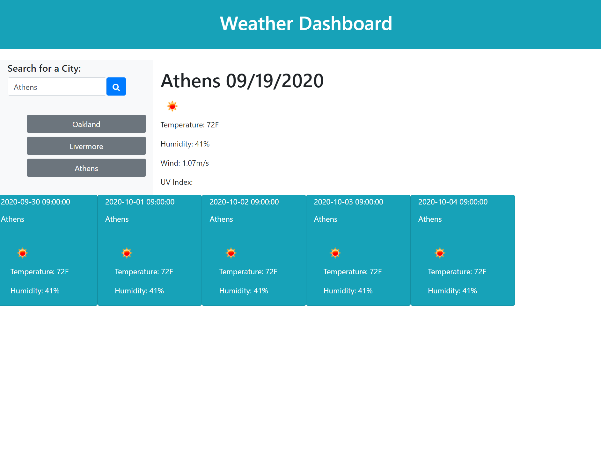

# 6-Weather-API

This is a general weather API link to a bootstrap generated page. Search for a city of your choosing with the search box and click the magnifying glass. This will display today's weather and the next 5 days. Searching for other cities will display a history after another search.

* Use of JQuery.
* Use of HTML
* Use of BootStrap
* Use of third party API

## Code

Sample of AJAX Code:

```
        function weatherSearch(queryURL){
        $.ajax({
            url: queryURL,
            method: "GET"
    
        }).then(function(response) {
            console.log(response);
            var weatherIcons = 'http://openweathermap.org/img/w/' + response.list[0].weather[0].icon + '.png';
            $('#city').text(citySearch + " " + moment().subtract(10, 'days').calendar());            
            $('#icon').attr('src', weatherIcons)
            $('#temperature').text("Temperature: " + parseInt((response.list[0].main.temp - 273.15) * 1.80 + 32) + "F");
            $('#humidity').text("Humidity: " + response.list[0].main.humidity + "%");
            $('#wind').text("Wind: " + response.list[0].wind.speed + "m/s");
```


## Usage

This page's function was created through JQuery. The app is a simple weather app that was designed to pull from an open source weather API. The updates are directly from the API. 




## Credits

* https://github.com/coding-boot-camp/
* https://www.w3schools.com/
* https://stackoverflow.com/questions/
* https://www.geeksforgeeks.org/
* https://guides.github.com/features/mastering-markdown/
* https://developer.mozilla.org/en-US/docs/Web/HTML/
* https://api.jquery.com/
* https://momentjs.com/
* https://webdesign.tutsplus.com/tutorials/build-a-simple-weather-app-with-vanilla-javascript--cms-33893
* https://openweathermap.org/

## Built With

* [HTML](https://developer.mozilla.org/en-US/docs/Web/HTML)
* [BootStrap](https://getbootstrap.com/)
* [JavaScript](https://developer.mozilla.org/en-US/docs/Web/JavaScript)

## Deployed Link

* https://dcuadra85.github.io/5-calender-time-api/


## Authors

* **Daniel Cuadra** 

- [GitHub](https://github.com/DCuadra85)
- [LinkedIn](https://www.linkedin.com/in/daniel-cuadra-3705aa39/)


## License

MIT License

Copyright (c) [2020] [DanielCuadra]

Permission is hereby granted, free of charge, to any person obtaining a copy
of this software and associated documentation files (the "Software"), to deal
in the Software without restriction, including without limitation the rights
to use, copy, modify, merge, publish, distribute, sublicense, and/or sell
copies of the Software, and to permit persons to whom the Software is
furnished to do so, subject to the following conditions:

The above copyright notice and this permission notice shall be included in all
copies or substantial portions of the Software.

THE SOFTWARE IS PROVIDED "AS IS", WITHOUT WARRANTY OF ANY KIND, EXPRESS OR
IMPLIED, INCLUDING BUT NOT LIMITED TO THE WARRANTIES OF MERCHANTABILITY,
FITNESS FOR A PARTICULAR PURPOSE AND NONINFRINGEMENT. IN NO EVENT SHALL THE
AUTHORS OR COPYRIGHT HOLDERS BE LIABLE FOR ANY CLAIM, DAMAGES OR OTHER
LIABILITY, WHETHER IN AN ACTION OF CONTRACT, TORT OR OTHERWISE, ARISING FROM,
OUT OF OR IN CONNECTION WITH THE SOFTWARE OR THE USE OR OTHER DEALINGS IN THE
SOFTWARE.